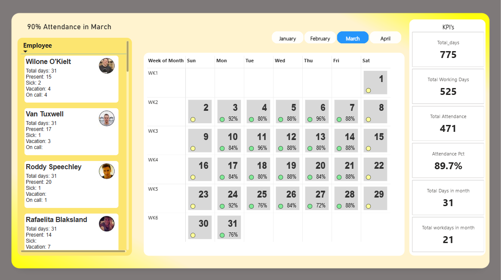

# Power BI Employee Attendance Report

A visually stunning and interactive **Employee Attendance Report** integrated into Power BI.
This project shows how to use interactive calendar visuals, employee profile cards, and **SVG-based DAX measures** to create a comprehensive attendance dashboard.

[Link of Report](https://app.powerbi.com/view?r=eyJrIjoiYTM5YWYyZjgtNzYyMS00YjBhLTlmNTctYjNhMDVkMjI4NmE4IiwidCI6ImM2ZTU0OWIzLTVmNDUtNDAzMi1hYWU5LWQ0MjQ0ZGM1YjJjNCJ9)
 
---

## 🚀 Features

- **Dynamic Employee Cards**
  - Shows the name, team, picture, and other information about the employee.
  - The report incorporates images that are hosted online.

- **Interactive Calendar View**
  - To view daily attendance, navigate between months.
  - DAX and calculated columns are used to dynamically adjust the calendar grid.

- **KPI Section**
  - When filters are changed, key attendance metrics are updated instantly.
  - Colour-coded statuses include *Present, Vacation, Remote Work*.

- **Visuals based on SVG**  
  - DAX is used to dynamically size and colour rectangles.
  - Visuals give attendance a distinctive representation by building upon fundamental SVG ideas.

---

## 📊 Data Sources  

- **Excel Attendance Data**
  - The format is matrix-style, with dates as rows and each employee as a column.
  - Status values: Remote, Absent, Vacation, Present, etc.  

- **Employee Dimension**
  - Name, Team, Profile Image URL, and Employee ID.

- **The calendar table was made using Power Query**
  - The following are included: Date, Month/Year, Holiday flag, Week of Month, and Day of Week.

- **Status Dimension** 
  - Different attendance statuses with the option of personalised colours.

---

## 🛠️ Workflow for the Project  

1. **Power Query Data Preparation**  
   - Attendance data was reshaped and extra rows were eliminated.
   - Employee columns were unpivoted into rows.
   - Constructed dimension tables for the calendar and status.

2. **Data Modelling** 
   - A star schema with dimensions connected to a fact table (attendance).
   - For time intelligence, the calendar was marked as a date table.  

3. **DAX & Design**  
   - **SVG-based measures** were developed for dynamic visuals.
   - KPIs, a calendar grid, and employee cards were created.  
   - Added design improvements and a gradient background.  

4. **Iteration & Testing**  
   - Verified visuals and attendance records.    

---
